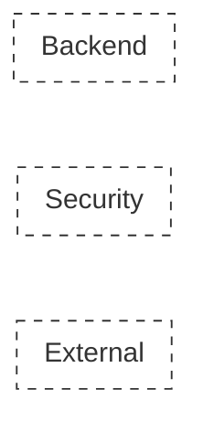

# DFD Creation Workflow

This document defines the standard workflow and conventions for creating Data Flow Diagrams (DFD) using Mermaid.js.

## Quick Start

1. Copy the template below
2. Define your nodes by layer (External → Security → Backend)
3. Add data flows with unique IDs
4. Preview in VS Code or [Mermaid Live Editor](https://mermaid.live)

---

## Incremental Creation Workflow

For complex systems, build the DFD in phases:

### Phase 1: Skeleton

1. Start with **style definitions** (copy from template)
2. Create **empty subgraphs** for each layer — just the containers, no nodes yet
3. Validate the structure renders correctly



### Phase 2: Add Nodes Layer by Layer

Work through one layer at a time:

1. **External layer first** — clients, external systems
2. **Security layer** — gateways, auth points
3. **Backend layer** — APIs, services, databases

After each layer, validate the diagram still renders.

### Phase 3: Connect Flows Incrementally

Add connections in logical groups:

1. **Asset/static flows** — S3 → Clients
2. **Ingress flows** — Clients → Gateways
3. **Egress flows** — Gateways → Backend
4. **Internal flows** — API → DB, Service → Service
5. **Return/async flows** — dotted lines last

### Phase 4: Assign IDs

Once structure is stable:

1. **Nodes and flows share the same ID namespace** — every ID must be globally unique
2. Number sequentially: if a node is `#10`, the next available ID is `#11` (whether node or flow)
3. Use a/b suffixes only for gateway-split flows (e.g., `#36a` ingress, `#36b` egress)
4. Keep a registry comment at the top to track used IDs

```
%% ID Registry:
%% #1-#9: External assets
%% #10-#19: Security layer
%% #20-#39: Backend nodes
%% #40-#59: Data flows
%% #60+: Reserved for expansion
```

---

## Tips for Large DFDs

- **Comment heavily** — use `%%` to mark sections
- **One subgraph at a time** — add, validate, repeat
- **Keep a node registry** — track used IDs in a comment block at the top
- **Split into multiple files** — create separate DFDs for subsystems if >50 nodes
- **Use direction** — `direction TB` inside subgraphs to control layout

---

## Conventions

### Node Naming

| Prefix | Type | Example |
|--------|------|---------|
| `S3_*` | External storage/assets | `S3_AdminAssets` |
| `Client_*` | Browser/client apps | `Client_EC_Demo` |
| `Gateway_*` | Security gateways | `Gateway_IAM` |
| `API_*_Cust` | Customer-facing APIs | `API_Loyalty_Cust` |
| `API_*_Admin` | Admin-facing APIs | `API_Loyalty_Admin` |
| `Service_*` | Internal services | `Service_CIAM` |
| `DB_*` | Databases | `DB_Loyalty` |

### Node Shapes

| Shape | Syntax | Use For |
|-------|--------|---------|
| Rectangle | `Node["Label"]` | Entities, APIs |
| Rounded | `Node("Label")` | Processes |
| Cylinder | `Node[("Label")]` | Databases |
| Hexagon | `Node{{"Label"}}` | Gateways/Decision points |

### Style Classes

```
classDef process fill:#e1f5fe,stroke:#01579b,stroke-width:2px,rx:5,ry:5;
classDef store fill:#fff9c4,stroke:#fbc02d,stroke-width:2px,shape:cylinder;
classDef gateway fill:#ffccbc,stroke:#bf360c,stroke-width:3px,shape:hexagon;
classDef entity fill:#f5f5f5,stroke:#616161,stroke-width:2px,shape:rect;
classDef boundary fill:none,stroke:#333,stroke-dasharray: 5 5;
```

- **process** (blue) — APIs, services
- **store** (yellow) — Databases
- **gateway** (orange) — Security gates, decision points
- **entity** (gray) — External entities, clients
- **boundary** (dashed) — Trust boundaries, subgraph containers

### Trust Boundary Rules

**No nested subgraphs.** Trust boundaries must be flat — there is no such thing as a nested VPC in the real world.

- ✅ `subgraph VPC_A` ... `subgraph VPC_B` (sibling boundaries)
- ❌ `subgraph VPC_A` containing `subgraph Subnet_A` (nested boundaries)

If you need to group nodes conceptually within a boundary, use comments (`%%`) instead of nested subgraphs.

### Data Flow IDs

- Use unique numeric IDs: `"#1 Label"`, `"#2 Label"`
- For gateway split flows, use suffixes: `"#36a Req"` → `"#36b Route"`
- Dotted lines for return/async flows: `-.  .->`

### Section Order

1. **Style Definition** — classDef declarations
2. **External Layer** — S3, client browsers
3. **Security Layer** — Gateways
4. **Backend Layer** — APIs, services, databases
5. **Data Flows** — Connections between nodes

---

## Template

```mermaid
graph LR
    %% ==========================================================
    %% Style Definition
    %% ==========================================================
    classDef process fill:#e1f5fe,stroke:#01579b,stroke-width:2px,rx:5,ry:5;
    classDef store fill:#fff9c4,stroke:#fbc02d,stroke-width:2px,shape:cylinder;
    classDef gateway fill:#ffccbc,stroke:#bf360c,stroke-width:3px,shape:hexagon;
    classDef entity fill:#f5f5f5,stroke:#616161,stroke-width:2px,shape:rect;
    classDef boundary fill:none,stroke:#333,stroke-dasharray: 5 5;

    %% ==========================================================
    %% 1. External Layer
    %% ==========================================================
    subgraph External ["External Systems"]
        direction TB
        S3_Assets["#1 Static Assets"]:::entity
    end
    class External boundary

    subgraph Clients ["Client Applications"]
        Client_Web["#10 Web App"]:::entity
        Client_Mobile["#11 Mobile App"]:::entity
    end
    class Clients boundary

    %% ==========================================================
    %% 2. Security Layer
    %% ==========================================================
    subgraph Security ["Security Gates"]
        Gateway_Auth{{"#20 Auth Gateway"}}:::gateway
    end
    class Security boundary

    %% ==========================================================
    %% 3. Backend Layer
    %% ==========================================================
    subgraph Backend ["Backend Services"]
        direction TB

        %% APIs
        API_Main("#30 Main API"):::process
        Service_Worker("#31 Worker Service"):::process

        %% Databases
        DB_Main[("#40 Main DB")]:::store
        DB_Cache[("#41 Cache")]:::store
    end
    class Backend boundary

    %% ==========================================================
    %% Data Flows
    %% ==========================================================

    %% Asset delivery
    S3_Assets -- "#2 Assets" --> Client_Web
    S3_Assets -- "#3 Assets" --> Client_Mobile

    %% Client to gateway
    Client_Web -- "#21a Request" --> Gateway_Auth
    Client_Mobile -- "#22a Request" --> Gateway_Auth

    %% Gateway to backend
    Gateway_Auth -- "#21b Authorized" --> API_Main
    Gateway_Auth -- "#22b Authorized" --> API_Main

    %% Internal flows
    API_Main -- "#32 Query" --> DB_Main
    API_Main -- "#33 Cache" --> DB_Cache
    API_Main -- "#34 Async" --> Service_Worker
    Service_Worker -- "#35 Write" --> DB_Main
```



---

## Checklist

- [ ] **All IDs are globally unique** — nodes and flows share the same namespace
- [ ] No duplicate IDs between nodes and flows
- [ ] Nodes are grouped by logical layer
- [ ] Style classes applied to all nodes
- [ ] Gateway flows use a/b suffix pattern
- [ ] ID registry comment is up to date
- [ ] Comments separate each section
- [ ] **No nested subgraphs** — all trust boundaries are flat (no subgraph inside subgraph)
